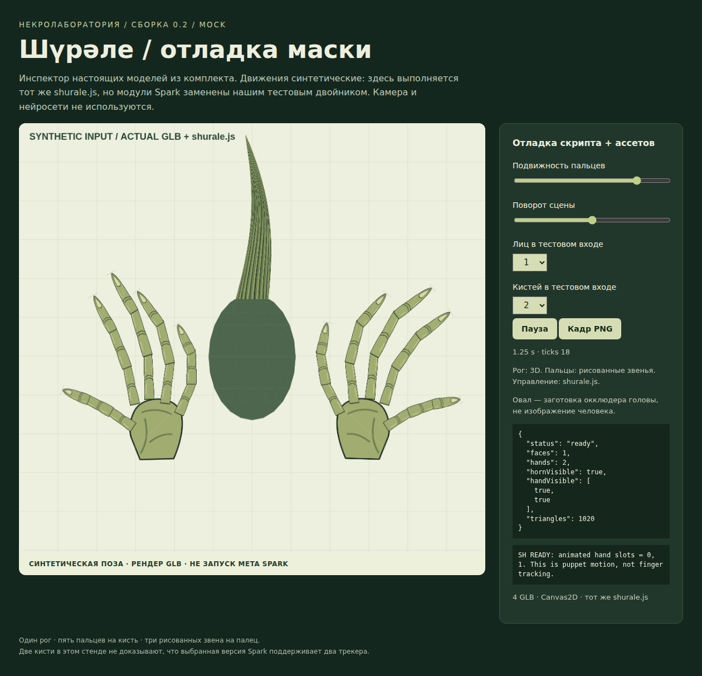

# Шүрәле / Necrolab 0.2

Один длинный 3D-рог, две рисованные кисти, JavaScript-адаптер для исторического Meta Spark и мини-книга о восстановлении закрытой AR-технологии.

**Статус: комплект исходников и графики для ручной сборки в Spark, НЕ сохранённый `.arproj` и НЕ опубликованный Instagram-эффект.** Meta Spark здесь не запускался. Установка редактора, вход, импорт моделей, экспорт и распознавание на телефоне не проверены.

## Что можно запустить прямо сейчас

Откройте `lab/preview.html` в браузере. Это автономная лаборатория без npm, сети, камеры и моделей распознавания. Она загружает настоящие GLB из комплекта и исполняет **тот же** `spark-import/scripts/shurale.js`, заменяя платформенные модули нашим реактивным тестовым двойником.

Кнопки и переключатели меняют время, подвижность, ракурс и число синтетически обнаруженных лиц/кистей. При потере рук пропадают обе кисти, но остаётся рог; при потере лица исчезает рог. Панель показывает реальные состояния адаптера и его сообщения. Это отладка контракта, а не запуск движка Meta.



## Состав

- `spark-import/objects/` — 4 GLB: рог, две кисти, заготовка окклюдера головы.
- `spark-import/scripts/shurale.js` — единственный файл скрипта для импорта; генерируется из `src/`.
- `graphics/svg/` и `graphics/png/` — редактируемые рисунки и растровые текстуры, включая атлас кисти.
- `docs/ASSEMBLY_RU.md` — точная сборка сцены, материалы, имена узлов, калибровка.
- `book/mini-book.md`, `.docx`, `.pdf` — мини-книга «Платформа ушла. Рог остался».
- `tests/`, `evidence/` — исполняемые проверки, журналы и скриншоты, не AI-визуализации.
- `tools/` — восстановление ассетов, стенда и книги из текстовых исходников.

## Важная граница эффекта

Рисованные пальцы имеют собственную анимацию. Адаптер привязывает всю кисть к `HandTracking.hand(i).cameraTransform`; отдельные суставы настоящих пальцев здесь **не отслеживаются**. Это не перенесённый в Spark MediaPipe. Поддержка второго слота зависит от конкретного редактора; при исключении он скрывается. Номера слотов не гарантируют левую/правую анатомическую руку.

Настоящие пальцы не удаляются нейросетью; слой маски лишь перекрывает часть изображения. Руки — плоские составные карточки, поэтому не заменяют объёмную кисть при взгляде сбоку. Рог — настоящая объёмная сетка.

## Пересборка

Python 3.10+, Node.js 18+, зависимости из `requirements.txt`. Для PDF нужен LibreOffice. Для браузерных тестов нужен Chromium либо браузер Playwright.

```sh
python -m pip install -r requirements.txt
python tools/build_assets.py
python tools/build_script.py
python tools/build_lab.py
node --test tests/*.test.cjs
python tests/assets_test.py
python -m playwright install chromium
python tests/browser_smoke.py
python tools/build_book.py --pdf
python tools/report.py
```

В Windows используйте `py -3` вместо `python`. Уже собранный `lab/preview.html` открывается двойным щелчком. Никаких токенов Instagram не требуется.

## Проверки и ограничения

См. `docs/TEST_REPORT.md`. Скриншоты получены в настоящем Chromium, программным Canvas2D-рендером. WebGL в среде подготовки не создавал контекст, поэтому он не заявлен как проверенный. Тест использует `page.set_content` с неизменённым автономным HTML; HTTP-хостинг не тестировался.

Результат готов для дальнейшей сборки в сохранившемся редакторе, но не является проверенным нативным релизом. Переименованием JSON в `.arproj` эта граница не обходится.

## Сборка в GitHub

Ветка `necrolab-v0.2` предназначена для проекта; исходная `main` сохраняется. Workflow `build.yml` генерирует бинарную графику, книгу и скриншоты из исходников, запускает проверки и сохраняет результаты обычными файлами в той же ветке. В репозитории нет ZIP вместо дерева проекта. Перед передачей архива или публикацией проверьте фактический итог workflow, а не только наличие его YAML.

Ссылки на внешние документы и границы их достоверности: `docs/SOURCES.md`.
