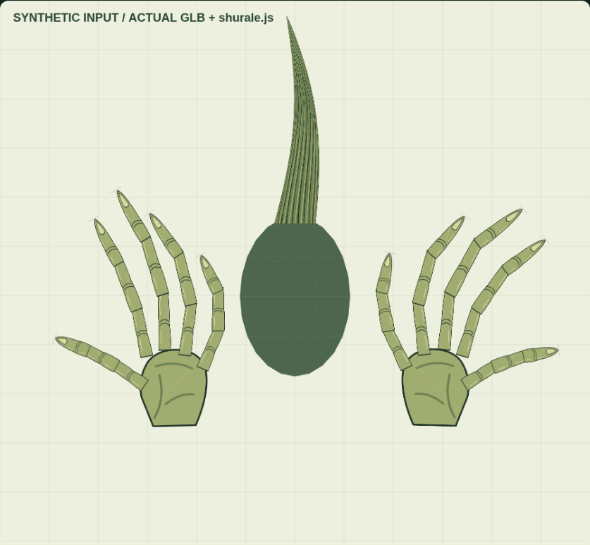
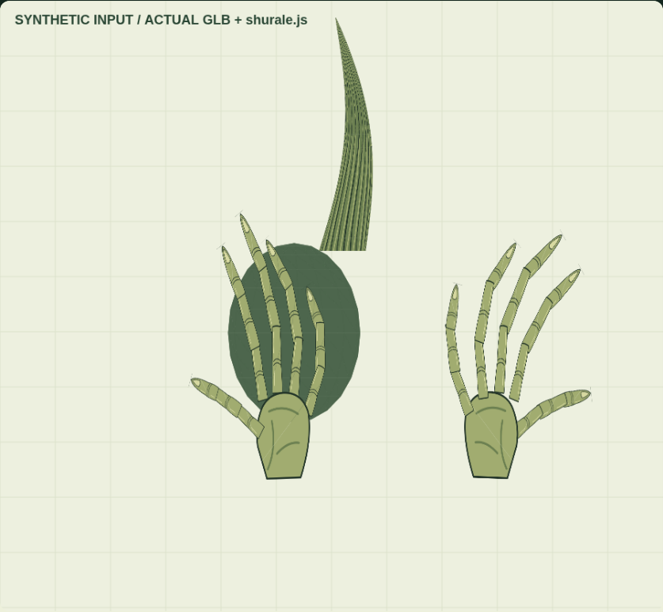
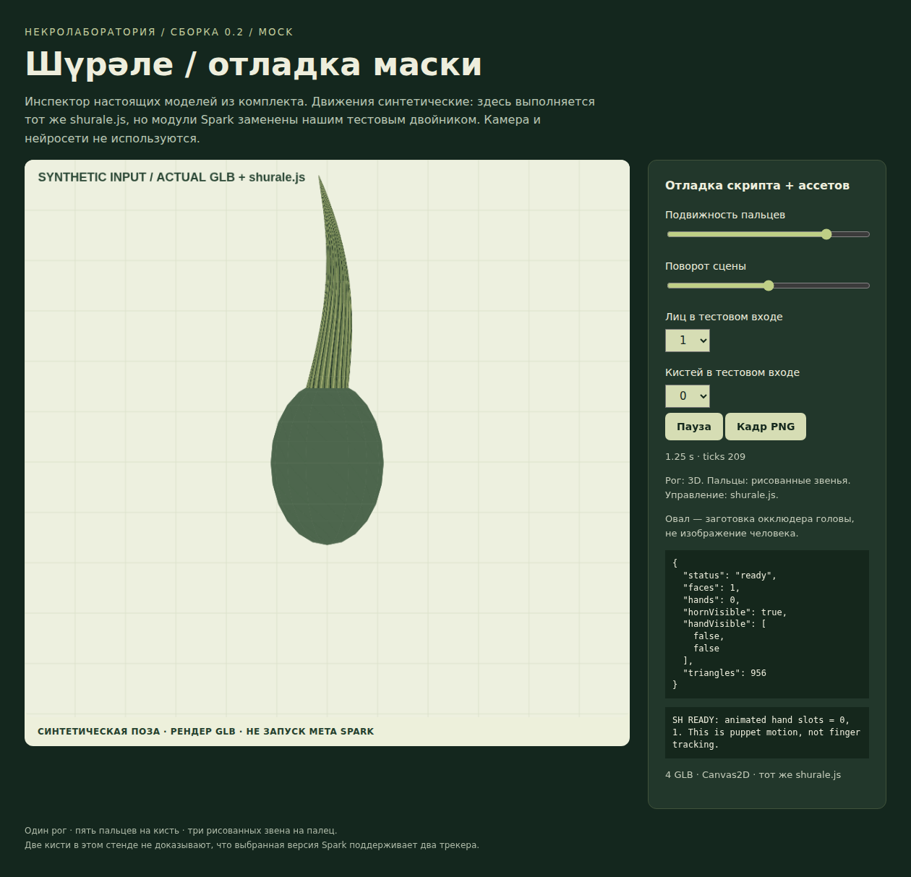

# Платформа ушла. Рог остался.

## Шүрәле: маленькая книга о некротехнологиях

Проект Eljah/shueraele. Издание 0.2.0, сентябрь 2026.

Рог, две рисованные кисти, JavaScript и инструкция, позволяющая понять эффект даже тогда, когда его платформа больше не помогает разработчику.

**Статус издания:** исходники и импортируемая графика подготовлены; математическая логика, адаптер на тестовых двойниках и автономный графический стенд проверены. Meta Spark Studio и его распознавание не запускались. Сохранённого редактором `.arproj` в этом издании нет.



## 1. Что мы здесь воскрешаем

Обычная инструкция по AR начинается с кнопки «Создать эффект». Наша начинается с вопроса: что останется от эффекта, когда этой кнопки больше нет? У «Шүрәле» можно сохранить рисунок, геометрию, правила движения, связь с координатами головы и кисти, описание материалов и испытания. Каталог эффектов, аккаунт и сервер публикации — другие части системы. Их наличие нельзя получить хорошей организацией папок.

Поэтому некротехнология здесь — не обход закрытого сервиса. Это воспроизводимая инженерная реконструкция. Мы отделяем собственную работу от чужого runtime, а подтверждённый результат — от правдоподобного предположения. Старый редактор может оказаться доступен, а может остановиться на авторизации. В обоих случаях исходники не должны превращаться в непонятный архив.

Замысел намеренно небольшой: один длинный рог на голове и две графические кисти с длинными пальцами. Рог следует за головой. Кисть следует за положением руки, а её пальцы живут собственной анимацией. Это театральная перчатка, а не медицински точная цифровая копия ладони. Такой художественный договор нужно сообщать заранее, а не после демонстрации.

Самая полезная вещь в комплекте — не эффектный кадр. Это возможность ответить: какой файл создал этот рог, какая функция согнула палец и какой тест проверил исчезновение руки? Хорошая некротехнология оставляет маршрут назад от результата к исходнику.

## 2. Четыре разных уровня готовности

Первый уровень — ассеты. Существует ли настоящая сетка, можно ли прочитать её вершины, содержится ли внутри нужная текстура? У нас рог и кисти сохранены в GLB, а рисунки — также в SVG и PNG. Контейнер GLB и иерархия узлов описаны стандартом glTF [S1]. Файл модели не равен проекту Spark: это только его импортируемая часть.

Второй уровень — поведение. Функция `SHMotion.pose` выдаёт углы, а адаптер распределяет их по узлам и привязывает корни к сигналам. Эти операции проверяются отдельно от нейросети. Третий уровень — нативное выполнение: конкретный Spark импортирует файлы, находит модули, получает реальные треки и рисует их правильно. Четвёртый — доставка эффекта пользователю через платформу.

В этом издании проверены первые два уровня и программный просмотр моделей. Третий остаётся открытым. Четвёртый не является целью реконструкции. Нельзя заменить третий уровень красивым вторым, а отсутствие четвёртого — назвать ошибкой нашего скрипта.

Скриншот с надписью `ready` тоже не универсальное доказательство. Он показывает, что конкретная инициализация завершилась в конкретной среде. Поэтому рядом с ним должны быть среда, входные данные и название скрипта. Наши кадры содержат пометку о синтетическом входе; исходники теста позволяют повторить их.

## 3. Как нарисованы руки и построен рог

Кисть — иерархия плоских карточек. Есть одна ладонь и пять пальцев, в каждом по три звена. Всего 16 маленьких сеток и 17 узлов на кисть с учётом калибровочного корня. Три звена у большого пальца выбраны ради одинакового управления графикой; это художественная структура, не утверждение об анатомии человека.

Каждая карточка содержит два треугольника. Вместе обе руки дают 64 треугольника. Для всех звеньев используется один рисунок-атлас 1024 × 1024: ладонь, основание пальца, среднее звено и кончик занимают четыре области. Сетка выбирает нужную область координатами UV. Не следует разрезать атлас на десятки отдельных материалов: это усложнит восстановление без художественной пользы.

Рог, напротив, объёмный. Генератор создаёт 19 поперечных колец, постепенно уменьшает радиус, изгибает ось и закрывает торцы. Получается 604 треугольника при высоте 0.275 метра. На сетку наложен рисунок коры. Небольшой зазор между визуальным основанием и головой исправляется посадкой anchor, а не случайным общим масштабом сцены.

Четвёртая модель — эллипсоид головы на 352 треугольника. Это заготовка окклюдера. В лаборатории он виден, чтобы можно было осмотреть форму; в эффекте ему нужен материал, закрывающий геометрию по глубине без рисования зелёного овала поверх лица. Приблизительный эллипсоид не знает причёску, уши и реальный профиль пользователя.



Геометрические единицы — метры, вверх направлена ось Y. Это собственный согласованный договор проекта, совместимый с координатной моделью glTF [S1]. После импорта в редактор договор необходимо проверить измерением, а не верой в расширение файла.

## 4. Пальцы движутся, но не читают мысли

Движение начинается с авторской позы раскрытой ладони. Для каждого пальца заданы угол разведения и два небольших сгиба. К этим значениям прибавляются синусоидальные колебания. У соседних пальцев фаза сдвинута, поэтому они шевелятся волной, а не складываются одинаковым веером.

```javascript
phase = 2 * Math.PI * (t * 0.6 + finger * 0.13 + slot * 0.2);
wave = Math.sin(phase);
baseAngle = authoredSplay + intensity * 0.09 * wave;
```

Это иллюстрация формулы; полный и исполняемый вариант находится в `src/motion.js`. Подвижность ограничивается диапазоном от 0 до 1. Ноль фиксирует исходную позу. Время берётся по модулю 600 секунд; выбранные частоты дают целое число циклов на этой границе, что проверяется тестом непрерывности.

Адаптер записывает углы в `transform.rotationZ` каждого из 30 звеньев. Геометрия дочернего звена начинается у конца предыдущего, поэтому изменение одного сустава переносит все последующие. Удаление иерархии при конвертации модели разрушит именно этот механизм.

Рог получает отдельное покачивание малой амплитуды. Основную ориентацию головы задаёт штатный Face Tracker, не синусоида. Это важно: декоративное движение нельзя перепутать с трекингом. Мы не получаем из API измеренные сгибы пальцев и не выдаём заранее написанную анимацию за распознавание.

## 5. Почему камера — это система координат

Родитель объекта определяет, в какой системе координат интерпретируются его положение и поворот. В адаптере вся кисть получает `hand.cameraTransform`. Следовательно, её anchor должен находиться прямо под Camera. Добавленный между ними повёрнутый или масштабированный Null применит лишнее преобразование, и маска начнёт уезжать.

У рога другая схема: он вложен в Face Tracker. Его координаты описывают смещение относительно головы. Локальный ноль геометрии помещён у основания, поэтому подстройка посадки понятна: перемещаем точку роста, а не центр длинного рога.

Зеркальность тоже должна иметь одного хозяина. Вторая кисть подготовлена как зеркальная композиция; адаптер устанавливает абсолютный масштаб калибровочного корня. Если ещё раз отразить изображение родителем, можно получить исходную сторону вместо зеркальной. Проверяется это не названием «левая», а направлением большого пальца на реальном кадре.

Опубликованный снимок деклараций HandTracking, изученный для проекта, содержит `cameraTransform`, `boundingBox` и `isTracked` [S2]. Мы не считаем этот сторонний снимок полной спецификацией всех версий. Он задаёт выбранный нами узкий контракт. Число доступных слотов и их фактическую устойчивость должен подтвердить конкретный редактор.

## 6. Ошибки тоже являются частью маски

Если лицо потеряно, рог должен исчезнуть, а не остаться висеть на последнем месте. Если пропала кисть, её графика не должна продолжать самостоятельно летать перед камерой. Поэтому видимость задаётся отдельно от геометрии и дополнительно учитывает `isTracked`, когда это поле доступно.

Сначала все anchors скрыты. После поиска объектов адаптер проверяет их имена. Если нет хотя бы одного обязательного узла, он сообщает `SH ERROR`, не запускает таймер и сохраняет графику скрытой. Такая остановка полезнее, чем полуисправная картинка: сообщение сразу указывает точный отсутствующий объект.

Если второй слот рук недоступен и вызов API выбрасывает исключение, адаптер оставляет первую руку, скрывает вторую и пишет предупреждение. Это контролируемое упрощение эффекта, а не доказательство, что все версии поддерживают две руки. Если runtime просто не выдаёт второй трек без исключения, видимость определяется числом реально обнаруженных кистей.

Номер слота не является надёжным именем человека или анатомической стороны. При перекрытии и повторном обнаружении руки могут поменяться индексами. В этой версии устойчивое сопоставление личности кисти не реализовано. В документации это должно называться ограничением, а не «редким непредсказуемым поведением пользователя».

## 7. Что именно показывают отладочные кадры

Лаборатория читает настоящие файлы GLB. Затем выполняет полный собранный `shurale.js`, подставляя наши модули Scene, Time, FaceTracking, HandTracking и Diagnostics. Сигналы пересчитываются при чтении, поэтому выключение трека меняет уже существующие связи, а не только стартовое состояние сцены.

Тестовый двойник не эмулирует движок Meta. Он знает ровно те методы, которыми пользуется адаптер. Такую границу важно сохранять даже после успешных тестов. В официальном репозитории Meta библиотеки mocks и e2e-тестов также выделены отдельно [S3]; в нашем проекте их реализация не заимствована.

В подготовительной среде WebGL-контекст не создавался. Вместо него инспектор использует программное проецирование треугольников в Canvas2D и наложение текстур. Порядок треугольников задаётся по глубине; это не полноценный z-buffer Spark. Ракурс, силуэт, иерархия и изменения позы проверяются, но сложная взаимная окклюзия требует нативного испытания.



Скриншоты снимает Playwright с действительно отрисованной страницы [S4]. Рядом сохраняется JSON с входными состояниями, углами и сообщениями скрипта. Сравнение двух изображений дополняется сравнением углов: иначе изменение часов в интерфейсе можно ошибочно принять за анимацию модели.

## 8. Сборка без шаманства

Для готовой лаборатории достаточно открыть `lab/preview.html`. В ней встроены модели, текстуры, скрипт и тестовый адаптер модулей. Она не обращается к CDN, не просит камеру и не получает данные пользователя. Автономность здесь настоящая, но относится именно к лаборатории, а не к установщику или авторизации Spark.

При изменении исходников выполните генерацию графики, сборку скрипта и сборку HTML. Отдельно запускаются Node-тесты, структурные проверки GLB и браузерный прогон. Команды собраны в README. Для книги есть свой сборщик; PDF требует LibreOffice и системных шрифтов, которые не входят в репозиторий.

В GitHub текстовые исходники служат первичным материалом. Workflow может восстановить PNG, GLB, HTML, DOCX, PDF и скриншоты, затем сохранить их обычным коммитом в рабочую ветку. Читатель получает не ZIP, в котором нельзя просмотреть изменения, а обычные папки. Логи workflow и дерево файлов нужно проверять после выполнения, а не путать YAML с уже сделанным действием.

Для нативной сборки следующий раздел книги даёт паспорт сцены. После импорта особенно важны имена, родитель Camera, альфа и двусторонние материалы. Сначала проверяйте простую позу, затем поворот, только потом сложные перекрытия. Когда неисправны одновременно материалы, координаты и трекинг неисправны, искать причину гораздо тяжелее.

## 9. Где заканчивается это издание

Эффект ещё не умеет удалять настоящие пальцы из видео и дорисовывать фон. Полупрозрачная или узкая графика покажет исходную руку. Человеческий кулак не превращается в идеально соответствующий ему цифровой кулак: пальцы перчатки продолжат собственную волну. Это свойства выбранной реализации.

Полноценное повторение жестов требует другого источника данных: суставов, устойчивой стороны кисти и обработки перекрытий. Добавление внешней модели в современную веб-камеру создаёт другую реализацию. Она может быть полезной, но нельзя без проверки называть её той же маской для исторического Spark.

Следующий содержательный шаг — открыть комплект в сохранившейся доверенной версии редактора, сохранить штатный проект и записать настоящий прогон. В отчёте должны появиться точная версия, камера, устройство, логи, измерения и дефекты. До этого формулировка «проверено в Spark» остаётся незаполненной строкой, а не красивым заголовком.

Когда-нибудь потеряется и этот браузерный стенд. Поэтому рядом лежат исходные рисунки, генератор сетки, простая математика и объяснение родительских связей. Для следующего разработчика важнее оставить понятные суставы проекта, чем ещё один неподвижный скриншот. Платформа ушла. Рог остался — и понятно, как он устроен.
